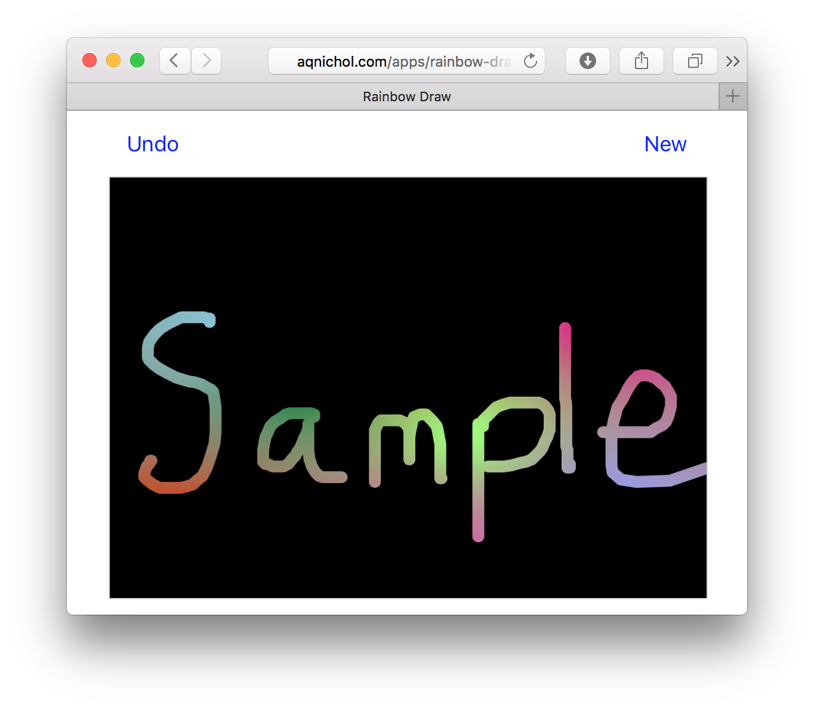

# Rainbow Draw

This is a digital implementation of crayon etching (scratch art). A lot of people have probably encountered this before, at least as a child (or even as a parent).

# Screenshot

Here is a demonstration of what a given drawing might look like. I have manually carved out the word "sample" using my laptop's touch pad. It is much easier to get good drawings on a touch screen device.

